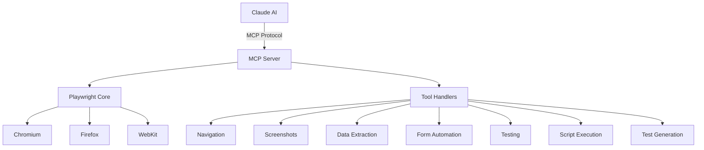

# MCP Playwright - Autonomous Web Testing & Automation

<div align="center">


**Autonomous web testing and automation powered by Model Context Protocol (MCP) and Playwright**

[Installation](./INSTALLATION.md) • [MCP Tools](./MCP_TOOLS.md) • [Usage](./CLAUDE_USAGE.md) • [Troubleshooting](./TROUBLESHOOTING.md)

</div>

## 🎯 Overview

MCP Playwright is a comprehensive web testing and automation framework that bridges **Playwright's powerful browser automation capabilities** with **Claude AI** through the Model Context Protocol (MCP). This integration enables Claude to autonomously:

- 🌐 Navigate and interact with websites
- 📸 Capture screenshots and visual data
- 🔍 Extract and analyze web content
- 📝 Fill and submit forms automatically
- 🧪 Run comprehensive web tests
- 🚀 Generate test scripts in multiple languages
- ♿ Perform accessibility audits
- ⚡ Measure performance metrics

## 🌟 Key Features

### Autonomous Testing
Claude can independently test websites without manual intervention, making decisions based on page content and structure.

### Multi-Browser Support
- **Chromium** - Chrome, Edge, and Chromium-based browsers
- **Firefox** - Mozilla Firefox
- **WebKit** - Safari and WebKit-based browsers

### Comprehensive Testing Capabilities
- **Functional Testing** - Forms, navigation, user flows
- **Visual Testing** - Screenshot comparison, visual regression
- **Performance Testing** - Core Web Vitals, load times
- **Accessibility Testing** - WCAG compliance, ARIA validation
- **SEO Testing** - Meta tags, structured data
- **Security Testing** - Console errors, mixed content

### Intelligent Automation
- **Smart Selectors** - Multiple fallback strategies
- **Auto-waiting** - Intelligent wait conditions
- **Error Recovery** - Automatic retry mechanisms
- **Parallel Execution** - Concurrent test running

## 🚀 Quick Start

### Prerequisites
- Node.js 18+ 
- npm or yarn
- Claude Desktop application

### Installation

```bash
# Clone the repository
git clone https://github.com/your-org/mcp-playwright.git
cd mcp-playwright

# Run the installation script
./install.sh
```

### Basic Usage with Claude

Once installed and configured, you can ask Claude:

```
"Use the playwright MCP server to test example.com"
"Take a screenshot of github.com"
"Extract all article titles from news.ycombinator.com"
"Generate an E2E test for my website"
```

## 📚 Documentation

### Setup & Configuration
- [Installation Guide](./INSTALLATION.md) - Complete setup instructions
- [Project Structure](./PROJECT_STRUCTURE.md) - Understanding the codebase
- [Advanced Configuration](./ADVANCED_CONFIGURATION.md) - Customization options

### Usage & Reference
- [MCP Tools Reference](./MCP_TOOLS.md) - Detailed tool documentation
- [Claude Usage Examples](./CLAUDE_USAGE.md) - Real-world examples
- [Testing Guide](./TESTING.md) - Validation and testing strategies

### Development & Operations
- [CI/CD Integration](./CI_CD.md) - Continuous integration setup
- [Troubleshooting](./TROUBLESHOOTING.md) - Common issues and solutions
- [Contributing](./CONTRIBUTING.md) - How to contribute

### Project Information
- [Changelog](./CHANGELOG.md) - Version history
- [License](./LICENSE.md) - MIT License

## 🛠️ MCP Tools Overview

| Tool | Purpose | Example |
|------|---------|---------|
| `navigate_to_page` | Navigate and get page info | Get title and content of a webpage |
| `take_screenshot` | Capture webpage screenshots | Visual documentation and testing |
| `extract_data` | Scrape data with selectors | Extract structured data from sites |
| `fill_form` | Automated form submission | Test form functionality |
| `test_website` | Run comprehensive tests | Performance, accessibility, SEO |
| `run_script` | Execute JavaScript | Custom page interactions |
| `generate_test` | Create test scripts | Generate Playwright tests |

## 🏗️ Architecture



## 💡 Use Cases

### Web Testing & QA
- Automated regression testing
- Cross-browser compatibility testing
- Visual regression testing
- Performance monitoring

### Web Scraping & Data Extraction
- Content aggregation
- Price monitoring
- Data mining
- Competitive analysis

### Process Automation
- Form filling automation
- Report generation
- Website monitoring
- Content validation

### Development Support
- Test script generation
- Debugging assistance
- Performance profiling
- Accessibility auditing

## 🤝 Integration

### Claude Desktop
The primary integration is with Claude Desktop through MCP. See [Claude Usage](./CLAUDE_USAGE.md) for examples.

### CI/CD Pipelines
Can be integrated into GitHub Actions, Jenkins, GitLab CI, and other CI/CD systems. See [CI/CD Integration](./CI_CD.md).

### API Usage
Can be used as a standalone API server for custom integrations.

## 📊 Performance

- **Fast Execution** - Headless mode for speed
- **Parallel Testing** - Multiple browsers simultaneously  
- **Resource Efficient** - Browser pooling and reuse
- **Scalable** - Horizontal scaling support

## 🔒 Security

- **Sandboxed Execution** - Isolated browser contexts
- **No Credential Storage** - Secure handling of sensitive data
- **Configurable Permissions** - Control tool access
- **Audit Logging** - Track all operations

## 🎓 Learning Resources

- [Playwright Documentation](https://playwright.dev)
- [MCP Protocol Specification](https://modelcontextprotocol.io)
- [Video Tutorials](./docs/tutorials/) (Coming Soon)
- [Example Projects](./examples/) (Coming Soon)

## 🌍 Community

- **GitHub Issues** - Report bugs and request features
- **Discussions** - Ask questions and share ideas
- **Discord** - Join our community server
- **Twitter** - Follow for updates

## 📈 Roadmap

- [ ] Visual testing with AI comparison
- [ ] Mobile device emulation
- [ ] Network condition simulation
- [ ] HAR file generation
- [ ] Video recording
- [ ] Custom reporter plugins
- [ ] Cloud browser support
- [ ] Distributed testing

## 🙏 Acknowledgments

- [Microsoft Playwright Team](https://github.com/microsoft/playwright)
- [Anthropic](https://anthropic.com) for Claude and MCP
- Open source community contributors

## 📄 License

This project is licensed under the MIT License - see the [LICENSE](./LICENSE.md) file for details.

---

<div align="center">

**[Get Started](./INSTALLATION.md)** • **[View Examples](./CLAUDE_USAGE.md)** • **[Report Issues](https://github.com/your-org/mcp-playwright/issues)**

Made with ❤️ by the MCP Playwright Team

</div>