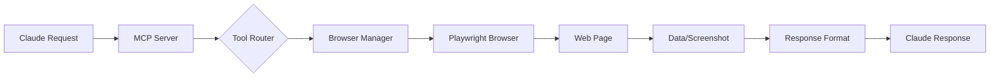
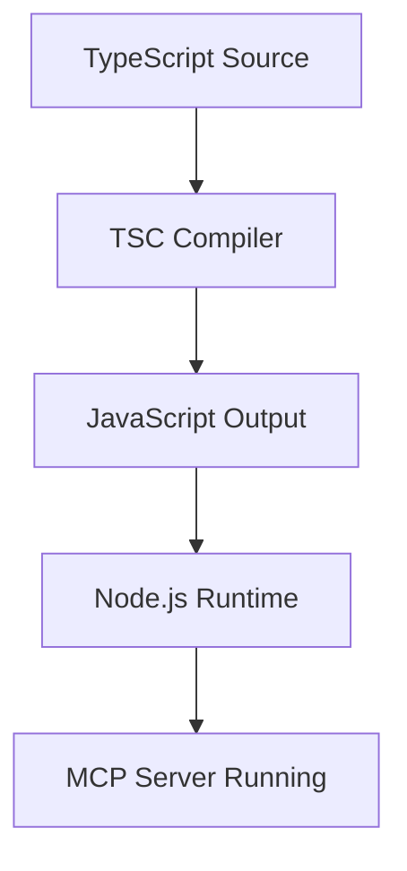

# Project Structure

Comprehensive overview of the MCP Playwright project organization and file structure.

## Directory Tree

```
/opt/mcp-playwright/
│
├── src/                           # TypeScript source files
│   └── index.ts                   # Main MCP server implementation
│
├── build/                         # Compiled JavaScript (generated)
│   └── index.js                   # Compiled MCP server
│
├── scripts/                       # Utility and automation scripts
│   ├── automation-generator.py    # Generate automation scripts
│   ├── capture-website.py        # Screenshot and data extraction
│   ├── quick-test.py             # Instant website testing
│   ├── run-tests.sh              # Test runner script
│   ├── codegen-example.sh        # Playwright codegen examples
│   └── install.sh                # Installation script
│
├── tests/                         # Test files
│   ├── e2e/                      # End-to-end tests
│   │   ├── js/                   # JavaScript/TypeScript tests
│   │   │   ├── example.spec.ts   # Example E2E test
│   │   │   └── codegen_example.spec.ts
│   │   └── python/               # Python tests
│   │       └── test_example.py   # Example Python test
│   ├── integration/              # Integration tests
│   │   ├── js/                   # JavaScript integration tests
│   │   └── python/               # Python integration tests
│   └── unit/                     # Unit tests
│       ├── js/                   # JavaScript unit tests
│       └── python/               # Python unit tests
│
├── fixtures/                      # Test data and files
│   └── test-file.txt             # Sample file for upload tests
│
├── reports/                       # Test reports and output
│   ├── screenshots/              # Captured screenshots
│   ├── playwright-report/        # Playwright HTML reports
│   ├── pytest-report.html        # Python test reports
│   └── ipchicken-data.json      # Example extracted data
│
├── docs/                          # Documentation
│   ├── README.md                 # Project overview
│   ├── MCP_TOOLS.md             # MCP tools reference
│   ├── CLAUDE_USAGE.md          # Claude usage examples
│   ├── INSTALLATION.md          # Installation guide
│   ├── PROJECT_STRUCTURE.md    # This file
│   ├── TESTING.md               # Testing guide
│   ├── TROUBLESHOOTING.md       # Troubleshooting FAQ
│   ├── ADVANCED_CONFIGURATION.md # Advanced config
│   ├── CI_CD.md                 # CI/CD integration
│   └── CHANGELOG.md             # Version history
│
├── venv/                         # Python virtual environment
│   ├── bin/                      # Python executables
│   ├── lib/                      # Python packages
│   └── include/                  # Python headers
│
├── node_modules/                 # Node.js dependencies
│
├── package.json                  # Node.js project configuration
├── package-lock.json            # Locked dependencies
├── tsconfig.json                # TypeScript configuration
├── playwright.config.ts         # Playwright configuration
├── pytest.ini                   # Pytest configuration
├── requirements.txt             # Python dependencies
├── claude_desktop_config.json   # Example Claude config
├── .env.example                 # Environment variables template
├── CLAUDE.md                    # Claude-specific documentation
├── README.md                    # Root project README
└── README_MCP.md               # MCP server documentation
```

## Core Components

### 1. MCP Server (`src/index.ts`)

The heart of the project - implements the MCP protocol server:

```typescript
// Key components:
- Server initialization
- Tool definitions
- Request handlers
- Browser management
- Error handling
```

**Responsibilities:**
- Handle MCP protocol communication
- Execute Playwright operations
- Manage browser instances
- Return formatted responses

### 2. Build Output (`build/`)

Compiled JavaScript ready for production:
- `index.js` - Transpiled server code
- Source maps for debugging

### 3. Scripts Directory (`scripts/`)

#### Python Scripts

**automation-generator.py**
- Generates test scripts from templates
- Supports 10+ automation types
- Outputs in multiple languages

**capture-website.py**
- Screenshots and data extraction
- API-driven browser control
- Base64 encoding support

**quick-test.py**
- Instant website validation
- Performance metrics
- Accessibility checks

#### Shell Scripts

**run-tests.sh**
- Orchestrates test execution
- Supports multiple languages
- Parallel test running

**install.sh**
- Automated setup
- Dependency installation
- Claude configuration

## Configuration Files

### Node.js Configuration

**package.json**
```json
{
  "name": "mcp-playwright",
  "type": "module",
  "scripts": {
    "build": "tsc",
    "dev": "tsx src/index.ts",
    "start": "node build/index.js"
  }
}
```

**tsconfig.json**
- TypeScript compiler options
- Module resolution
- Path mappings

### Testing Configuration

**playwright.config.ts**
- Browser configurations
- Test directories
- Reporter settings
- Timeouts and retries

**pytest.ini**
- Python test discovery
- Markers and fixtures
- Report generation

### Environment Configuration

**.env.example**
```bash
BASE_URL=http://localhost:3000
HEADLESS=true
WORKERS=4
DEBUG=false
```

## Key Files Explained

### TypeScript Source

**src/index.ts**

Primary functions:
1. `Server` - MCP server instance
2. `BrowserManager` - Manages browser lifecycle
3. `Tool Handlers` - Execute specific operations
4. `Schema Validators` - Validate input parameters

### Test Files

**tests/e2e/js/example.spec.ts**
- Demonstrates Playwright Test syntax
- Covers common testing patterns
- Includes assertions and waits

**tests/e2e/python/test_example.py**
- Python pytest examples
- Class-based test organization
- Fixture usage

### Utility Scripts

**scripts/automation-generator.py**

Templates available:
- Basic automation
- Form filling
- Web scraping
- Website monitoring
- E2E testing
- API testing
- Visual testing
- Performance testing
- Accessibility testing
- Custom workflows

## Data Flow



## File Categories

### Source Code
- `src/` - TypeScript source
- `build/` - Compiled output
- `scripts/` - Automation scripts

### Testing
- `tests/` - Test suites
- `fixtures/` - Test data
- `reports/` - Test results

### Configuration
- Root config files
- Environment templates
- CI/CD configurations

### Documentation
- `docs/` - User guides
- `README` files
- API references

## Development Workflow

### 1. Making Changes

```bash
# Edit source
vim src/index.ts

# Build
npm run build

# Test
npm test
```

### 2. Adding New Tools

1. Define schema in `src/index.ts`
2. Add handler function
3. Update tool list
4. Document in `docs/MCP_TOOLS.md`

### 3. Testing Changes

```bash
# Run MCP inspector
npx @modelcontextprotocol/inspector node build/index.js

# Test with Claude
# Restart Claude Desktop after changes
```

## Important Paths

### Execution Paths
- MCP Server: `/opt/mcp-playwright/build/index.js`
- Python Scripts: `/opt/mcp-playwright/scripts/*.py`
- Shell Scripts: `/opt/mcp-playwright/scripts/*.sh`

### Output Paths
- Screenshots: `/opt/mcp-playwright/reports/screenshots/`
- Test Reports: `/opt/mcp-playwright/reports/`
- Logs: `/opt/mcp-playwright/logs/` (if configured)

### Configuration Paths
- Claude Config: `~/Library/Application Support/Claude/claude_desktop_config.json`
- Environment: `/opt/mcp-playwright/.env`

## Module Dependencies

### Core Dependencies
```
@modelcontextprotocol/sdk - MCP protocol implementation
playwright - Browser automation
zod - Schema validation
```

### Development Dependencies
```
typescript - Type checking
tsx - TypeScript execution
@types/node - Node.js types
```

### Python Dependencies
```
playwright - Python browser automation
pytest - Testing framework
pytest-playwright - Pytest integration
```

## Build Process



## Testing Structure

### Test Organization
- **E2E Tests**: Complete user journeys
- **Integration Tests**: Component interactions
- **Unit Tests**: Individual functions

### Test Execution
- JavaScript: `npm test`
- Python: `pytest`
- All: `./scripts/run-tests.sh`

## Extension Points

### Adding Tools
1. Define in `src/index.ts`
2. Add schema validation
3. Implement handler
4. Document usage

### Custom Scripts
1. Add to `scripts/`
2. Make executable
3. Document purpose

### Test Extensions
1. Add test files
2. Update configurations
3. Document patterns

## Maintenance

### Regular Tasks
- Update dependencies: `npm update`
- Clean build: `rm -rf build && npm run build`
- Clear reports: `rm -rf reports/*`

### Monitoring
- Check logs for errors
- Review test reports
- Monitor performance

---

This structure supports scalable web automation with clear separation of concerns and easy maintenance.